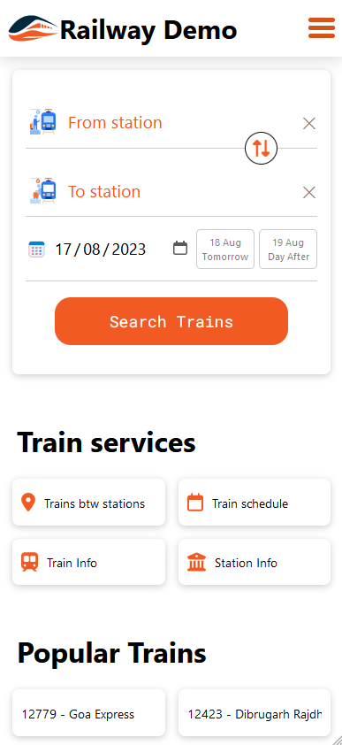

# RailwayFrontendVue

This is a demo website made with Vue 3, demoing [RailwayAPI](https://api.railwayapi.site/) using official API wrapper [NPM](https://www.npmjs.com) package [api-railway](https://www.npmjs.com/package/api-railway).

Working example of this site can be found on https://demo.railwayapi.site/



## Project Setup

```sh
git clone https://github.com/ZennoZenith/RailwayFrontendVue.git
cd RailwayFrontendVue
npm install
```

### Compile and Hot-Reload for Development

```sh
npm run dev
```

### Type-Check, Compile and Minify for Production

```sh
npm run build
```

### Lint with [ESLint](https://eslint.org/)

```sh
npm run lint
```
